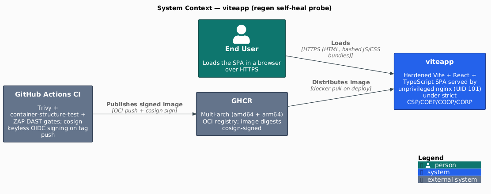

[](https://github.com/AndriyKalashnykov/viteapp/actions/workflows/ci.yml)
[](https://hits.sh/github.com/AndriyKalashnykov/viteapp/)
[](https://opensource.org/licenses/MIT)
[](https://app.renovatebot.com/dashboard#github/AndriyKalashnykov/viteapp)

# viteapp — Hardened Vite + React SPA Pipeline

A Vite + React + TypeScript SPA delivered as a hardened multi-arch (`amd64`/`arm64`) nginx container, signed with cosign keyless OIDC on tag push to GHCR. The CI pipeline gates publish on Trivy filesystem + image scans (CRITICAL/HIGH blocking), container-structure-test, ZAP baseline DAST in fail-on-warn mode, 80 % Vitest coverage, 49 curl-based e2e assertions, a Playwright Chromium browser smoke with axe accessibility checks, and a Lighthouse CI budget (performance / accessibility / best-practices / SEO). nginx serves the SPA under strict CSP/COEP/COOP/CORP with immutable cache for hashed `/assets/*` and `no-cache` on the index + SPA fallback.

<p align="center"></p>

<p align="center"><sub>C4 Context — source: <a href="docs/diagrams/c4-context.puml"><code>docs/diagrams/c4-context.puml</code></a>; regenerate with <code>make diagrams</code></sub></p>

| Component        | Technology                                                  |
| ---------------- | ----------------------------------------------------------- |
| Language         | TypeScript 6 (strict mode)                                  |
| Framework        | React 19                                                    |
| Build tool       | Vite 8 (Rolldown bundler, terser minifier)                  |
| Testing          | Vitest 4 + @testing-library/react 16 + jsdom + v8 coverage (80% thresholds) |
| Runtime          | Node.js 24.17.0 (pinned via `.nvmrc`)                       |
| Package manager  | pnpm 11 (pinned via `package.json` `packageManager`)        |
| Version manager  | mise (reads `.nvmrc`; pins act/hadolint/trivy/gitleaks/container-structure-test in `.mise.toml`) |
| Container        | Official nginx (alpine), DIY unprivileged UID 101 (multi-arch amd64/arm64) |
| CI/CD            | GitHub Actions + Trivy + container-structure-test + ZAP DAST + Cosign keyless OIDC |
| Code quality     | ESLint 10 + Prettier 3 + hadolint 2 + gitleaks 8 + Trivy + mermaid-cli 11 |
| Diagrams         | PlantUML + C4-PlantUML (rendered via pinned `plantuml/plantuml` Docker image, committed PNG + drift gate) |
| Dependency mgmt  | Renovate (PR automerge gated by the `ci-pass` required check) |

## Quick Start

```bash
make deps      # install mise + Node + pnpm + binary tools (act, hadolint, trivy, gitleaks, container-structure-test)
make build     # type-check and build for production
make test      # run Vitest tests
make run       # start Vite dev server with HMR
# Open http://localhost:5173
```

## Prerequisites

| Tool                                           | Version | Purpose                     |
| ---------------------------------------------- | ------- | --------------------------- |
| [GNU Make](https://www.gnu.org/software/make/) | 3.81+   | Build orchestration         |
| [mise](https://mise.jdx.dev/)                  | latest  | Portfolio version manager — auto-installed by `make deps`; reads `.nvmrc` + `.mise.toml` |
| [Node.js](https://nodejs.org/)                 | 24+     | JavaScript runtime — installed by mise from `.nvmrc` |
| [pnpm](https://pnpm.io/)                       | 11.9+   | Package manager — installed by `make deps` via corepack (version pinned in `package.json`) |
| [Docker](https://www.docker.com/)              | latest  | Container builds + `make diagrams` (PlantUML render), `make mermaid-lint` (optional) |
| [Git](https://git-scm.com/)                    | latest  | Version control             |

`make deps` also installs the binary tools pinned in `.mise.toml`: [act](https://github.com/nektos/act) (local CI runs), [hadolint](https://github.com/hadolint/hadolint) (Dockerfile lint), [trivy](https://github.com/aquasecurity/trivy) (CVE scan), [gitleaks](https://github.com/gitleaks/gitleaks) (secret scan), and [container-structure-test](https://github.com/GoogleContainerTools/container-structure-test) (image structure assertions).

Install all required dependencies:

```bash
make deps
```

## Architecture

Single-page React application built with Vite and served as a static bundle by nginx.

- **Entry flow:** `index.html` → `src/main.tsx` (wraps `App` in `ThemeProvider`) → `src/App.tsx`
- **State:** React Context API — a light/dark theme toggle (`ThemeProvider` + `useTheme`) that persists to `localStorage`, defaults to the OS `prefers-color-scheme`, and applies via `<html data-theme>` + CSS variables (CSP-safe, no inline styles); plus standard hooks
- **Path alias:** `@` → `src/` (configured in `vite.config.ts` and `tsconfig.json`)
- **Performance:** Web Vitals via `src/reportWebVitals.ts`; all `console.*` calls stripped in production by terser `drop_console`

**Build & bundle (`vite.config.ts`)**

- Target: ES2022
- Terser minification with `drop_console` + `drop_debugger`
- CSS minification: esbuild (`build.cssMinify`) — chosen over lightningcss because lightningcss doesn't support ES year targets
- Manual chunks: `react` vendor bundle
- Bundler: Rolldown (Vite 8 default); config key remains `rollupOptions` for backward compatibility

**Container runtime**

Multi-stage Docker build: Node 24 Alpine builder → official `nginx:1.31-alpine` server with a DIY unprivileged-user setup. The Dockerfile drops the `user nginx;` directive from `nginx.conf`, relocates the PID file from `/run/nginx.pid` (root-only) to `/tmp/nginx.pid`, chowns `/var/cache/nginx` and `/var/log/nginx` to UID 101, and runs the entire process under `USER 101`. `apk upgrade --no-cache` patches Alpine OS CVEs — but only because every cache-importing build sets `no-cache-filters: server`: `--no-cache` controls apk's *index*, not Docker's *layer* cache, so on a pinned-digest base the upgrade layer would otherwise be replayed indefinitely and ship unpatched packages behind a green build. `make check-dockerfile-stage` keeps that filter honest and `make image-apk-check` asserts the upgrade actually ran.

The project previously used `nginxinc/nginx-unprivileged` but switched to the official image because the unprivileged variant lagged the official rebuild cadence by multiple patch releases (e.g. stuck at 1.29.5 while upstream shipped 1.29.6/7/8).

Nginx (`nginx/nginx.conf`):

- Listens on port 8080 as numeric UID 101 (non-root)
- SPA fallback: `try_files $uri /index.html`
- Health endpoints: `/internal/isalive`, `/internal/isready`
- Security headers: `server_tokens off`, `X-Content-Type-Options`, `X-Frame-Options`, `Referrer-Policy`, `Permissions-Policy`, `Content-Security-Policy`, `Cross-Origin-Embedder-Policy`, `Cross-Origin-Opener-Policy`, `Cross-Origin-Resource-Policy`
- Cache control: hashed `/assets/*` get `public, max-age=31536000, immutable`; `/` and SPA fallback get `no-cache, no-store, must-revalidate`; health endpoints get `no-store`

## Build & Package

| Stage         | Command            | Output                                              | Notes                                                  |
| ------------- | ------------------ | --------------------------------------------------- | ------------------------------------------------------ |
| Compile       | `make build`       | `dist/` (Vite Rolldown bundle, terser-minified)     | `tsc && vite build`                                    |
| OCI image     | `make image-build` | `viteapp:<tag>` in local Docker daemon (multi-stage)| Node 24 alpine builder → official nginx 1.31-alpine    |
| Image scan    | CI `docker` job    | Trivy fail-on CRITICAL/HIGH (`ignore-unfixed: true`)| Locally: included in `make ci-run` via act             |
| Image structure | `make image-cst` | container-structure-test pass/fail                  | Asserts USER 101, EXPOSE 8080, file presence, nginx -t |

For tag-gated GHCR publishing see [CI/CD](#cicd) — the `docker` job builds, scans, structure-tests, smoke-tests, pushes multi-arch (`linux/amd64,linux/arm64`) on `v*` tags, and signs every digest with cosign keyless OIDC.

## Available Make Targets

Run `make help` to see all available targets.

### Build & Run

| Target         | Description                                           |
| -------------- | ----------------------------------------------------- |
| `make install` | Install project dependencies via pnpm                 |
| `make build`   | Type-check with tsc and build for production via Vite |
| `make run`     | Start Vite dev server with HMR                        |
| `make clean`   | Remove `node_modules/`, `dist/`, `coverage/`, and `zap-output/` |

### Testing

| Target                | Description                                                                 |
| --------------------- | --------------------------------------------------------------------------- |
| `make test`           | Run Vitest unit tests (fast, jsdom)                                         |
| `make coverage-check` | Run Vitest with coverage thresholds (CI gate, 80%)                          |
| `make e2e`            | End-to-end tests against the built container (health, SPA fallback, headers) |
| `make e2e-browser`    | Playwright Chromium smoke against the built container (counter, theme toggle, axe a11y, CSP) |
| `make lighthouse`     | Lighthouse CI budgets (perf/a11y/best-practices/SEO) against the built container |
| `make dast`           | ZAP baseline DAST scan against the built image (mirrors CI gate)            |

### Code Quality

| Target              | Description                                                       |
| ------------------- | ----------------------------------------------------------------- |
| `make check-node-alignment` | Verify the Node version matches across `.nvmrc` and Dockerfile (Renovate split-drift guard) |
| `make check-minifier-deps` | Verify every minifier named in `vite.config.ts` is a declared dependency (esbuild/terser optional-peer guard) |
| `make check-dockerfile-stage` | Verify `ci.yml`'s `no-cache-filters` matches the Dockerfile's final stage, and that every gha-cached build carries it (makes the apk-upgrade fix fail-closed) |
| `make lint`         | Run ESLint and hadolint on source files                           |
| `make vulncheck`    | Check for known vulnerabilities in dependencies (moderate+)       |
| `make trivy-fs`     | Trivy filesystem scan (vuln, secret, misconfig)                   |
| `make secrets`      | Scan repository for leaked secrets via gitleaks                   |
| `make static-check` | Composite quality gate (check-node-alignment, check-dockerfile-stage, check-minifier-deps, format-check, lint, vulncheck, trivy-fs, secrets, mermaid-lint, diagrams-check) |
| `make mermaid-lint` | Parse every ` ```mermaid ` fenced block via pinned `minlag/mermaid-cli`   |
| `make diagrams`     | Render PlantUML architecture diagrams (`docs/diagrams/*.puml`) to PNG via pinned `plantuml/plantuml` |
| `make diagrams-check` | Verify committed diagram PNGs match current PlantUML source (CI drift gate) |
| `make format`       | Format source files with Prettier                                 |
| `make format-check` | Check formatting without writing                                  |

### CI

| Target        | Description                                                                              |
| ------------- | ---------------------------------------------------------------------------------------- |
| `make ci`     | Run full local CI pipeline (install, static-check, coverage-check, build, deps-prune-check) |
| `make ci-run`     | Run GitHub Actions workflow locally via [act](https://github.com/nektos/act) (push event) |
| `make ci-run-tag` | Run CI with a tag event via act (exercises docker job + DAST gate)                        |

### Docker

| Target             | Description                                                                |
| ------------------ | -------------------------------------------------------------------------- |
| `make image-build` | Build Docker image                                                         |
| `make image-run`   | Run Docker container on port 8080                                          |
| `make image-stop`  | Stop the production Docker container                                       |
| `make image-cst`   | Container-structure-test against the built image (USER, EXPOSE, file presence) |
| `make image-apk-check` | Assert the built image's `apk upgrade` layer actually ran (catches a replayed cache layer) |

### Utilities

| Target                   | Description                                                       |
| ------------------------ | ----------------------------------------------------------------- |
| `make help`              | List available tasks                                              |
| `make deps`              | Install mise + Node + pnpm + binary tools from `.mise.toml`       |
| `make deps-update`       | Update dependencies to latest compatible versions (`pnpm update`) |
| `make deps-prune`        | Check for unused dependencies                                     |
| `make deps-prune-check`  | Verify no prunable dependencies (CI gate)                         |
| `make release`           | Create and push a new tag (interactive prompt for vX.Y.Z)         |
| `make renovate`          | Run Renovate locally in dry-run mode (requires `GITHUB_TOKEN`)    |
| `make renovate-validate` | Validate Renovate configuration                                   |

Or use pnpm scripts directly:

```bash
pnpm dev              # Vite dev server
pnpm build            # tsc + vite build
pnpm test             # Vitest
pnpm lint             # ESLint
pnpm prettier         # Format src/**/*.{ts,tsx,js,jsx}
pnpm prettier:diff    # Check formatting without writing
```

## CI/CD

GitHub Actions runs on every push to `main`, tags `v*`, pull requests, and `workflow_call` (reusable).

| Job              | Triggers       | Steps                                                                                          |
| ---------------- | -------------- | ---------------------------------------------------------------------------------------------- |
| **changes**      | push, PR, tags | `dorny/paths-filter` — sets `outputs.code` true when non-doc files change (incl. `docs/diagrams/**` so the diagram drift gate runs). Tag push always true |
| **static-check** | code change    | Install, `make static-check` (check-node-alignment, check-dockerfile-stage, check-minifier-deps, format-check, lint, vulncheck, trivy-fs, secrets, mermaid-lint, diagrams-check)  |
| **build**        | code change    | Install, Build (after static-check)                                                            |
| **test**         | code change    | Install, `make coverage-check` (Vitest + 80% thresholds, after static-check)                   |
| **e2e**          | code change    | Build image, `make e2e` — curl-based tests against nginx (health, SPA fallback, headers, hashed bundle, 404 fallback) |
| **e2e-browser**  | code change    | Build image, `make e2e-browser` — Playwright Chromium against the built container (boot, counter, theme toggle + persistence, axe a11y in both themes, CSP). Browser binary cached. Skipped under act |
| **lighthouse**   | code change    | Build image, `make lighthouse` — Lighthouse CI budgets (perf ≥0.9, a11y ≥0.95, best-practices ≥0.95, SEO ≥0.9) against the built container. Skipped under act |
| **docker**       | code change    | Build-for-scan → Trivy → apk-upgrade mechanism gate → container-structure-test → Smoke → Multi-arch build (every push) → (on `v*` tags only) Push → Trivy scan of the pushed digest → Cosign signing |
| **dast**         | code change    | Build → start → ZAP baseline (fail-on-warn; `.zap/baseline-rules.tsv` ignores informational rules) → upload report |
| **ci-pass**      | all            | Aggregation gate (`if: always()`) — single required check for branch protection                 |

A [diagram-regen workflow](.github/workflows/diagram-regen.yml) regenerates the committed C4 PNG on a render-affecting Renovate bump (the C4-PlantUML `!include` version or `PLANTUML_VERSION`) or on demand via the `regen-diagrams` label — because Renovate can't run `make diagrams` itself. It commits the corrected PNG back; the merge is finished manually (the Repository Ruleset blocks the bot's commit-back CI).

A weekly [cleanup workflow](.github/workflows/cleanup-runs.yml) deletes workflow runs older than 7 days (keeping a minimum of 5).

Docker images are pushed to `ghcr.io` as multi-arch (`linux/amd64` + `linux/arm64`) with GHA build cache.

### Pre-push image hardening

The `docker` job runs the following gates **before** any image is pushed to GHCR. Any failure blocks the release.

| #   | Gate                                 | Catches                                            | Tool                                             |
| --- | ------------------------------------ | -------------------------------------------------- | ------------------------------------------------ |
| 1   | Build local single-arch image        | Build regressions on the runner architecture       | `docker/build-push-action` with `load: true`     |
| 2   | **Trivy image scan** (CRITICAL/HIGH) | CVEs in the nginx base image, OS packages, layers  | `aquasecurity/trivy-action` with `image-ref:`    |
| 3   | **Container structure test**         | USER 101, EXPOSE 8080, file presence, nginx -t     | [container-structure-test](https://github.com/GoogleContainerTools/container-structure-test) |
| 4   | **Smoke test**                       | Container boots and serves `/internal/isalive`     | `docker run` + `curl` health probe               |
| 5   | **ZAP baseline DAST scan**           | Missing security headers, misconfigs, info leaks   | [OWASP ZAP](https://www.zaproxy.org/) baseline (cached image, fail-on-warn, parallel `dast` job) |
| 6   | Multi-arch build (every push)        | arm64 cross-compile regressions surface pre-tag    | `docker/build-push-action` (push gated on tag)   |
| 7   | Multi-arch push (tag only)           | Publishes for both `linux/amd64` and `linux/arm64` | `docker/build-push-action` `push: true`          |
| 8   | **Cosign keyless OIDC signing**      | Sigstore signature on the manifest digest          | `sigstore/cosign-installer` + `cosign sign`      |

Verify a published image's signature with:

```bash
cosign verify ghcr.io/andriykalashnykov/viteapp:<tag> \
  --certificate-identity-regexp 'https://github\.com/AndriyKalashnykov/viteapp/.+' \
  --certificate-oidc-issuer https://token.actions.githubusercontent.com
```

> Note: buildkit `provenance` / `sbom` attestations are disabled — they inject `unknown/unknown` entries into the OCI index that break the GHCR "OS / Arch" UI tab. Cosign keyless signing provides supply-chain verification.

### Required Secrets and Variables

No additional secrets are required. The workflow uses only `GITHUB_TOKEN` (auto-provided by GitHub Actions) for GHCR login and OIDC token minting (cosign keyless signing).

[Renovate](https://docs.renovatebot.com/) keeps dependencies up to date and merges them via PR automerge once the `ci-pass` check passes (`automergeType: pr`; platform automerge is disabled to avoid the native auto-merge registration race that can merge a red bump before the check registers).
