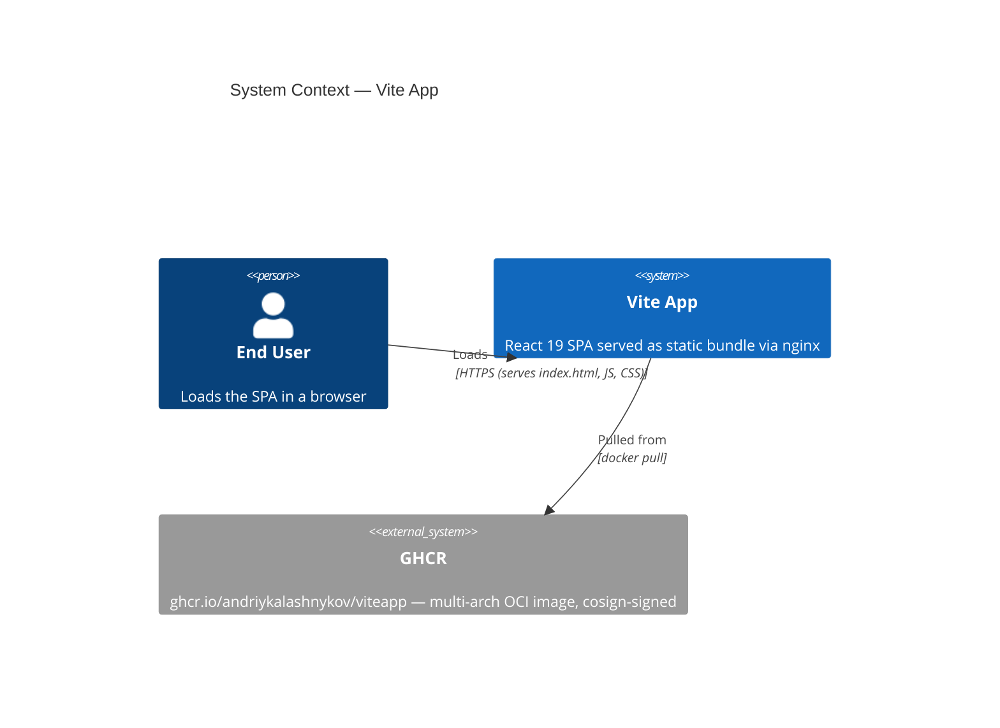

[](https://github.com/AndriyKalashnykov/viteapp/actions/workflows/ci.yml)
[](https://hits.sh/github.com/AndriyKalashnykov/viteapp/)
[](https://opensource.org/licenses/MIT)
[](https://app.renovatebot.com/dashboard#github/AndriyKalashnykov/viteapp)

# Vite App

React 19 SPA built with [Vite 8](https://vite.dev) and TypeScript (strict mode). Deployed as a multi-arch Docker image via nginx.



| Component        | Technology                                                  |
| ---------------- | ----------------------------------------------------------- |
| Language         | TypeScript 6.0 (strict mode)                                |
| Framework        | React 19.2                                                  |
| Build tool       | Vite 8.0 (Rolldown bundler, terser minifier)                |
| Testing          | Vitest 4.1 + @testing-library/react 16 + jsdom + v8 coverage (80% thresholds) |
| Runtime          | Node.js 24.14 (pinned via `.nvmrc`)                         |
| Package manager  | pnpm 10.33                                                  |
| Container        | Official nginx 1.29-alpine, DIY unprivileged UID 101 (multi-arch amd64/arm64) |
| CI/CD            | GitHub Actions + Trivy + ZAP DAST + Cosign keyless OIDC         |
| Code quality     | ESLint 10 + Prettier 3.8 + hadolint 2.14 + gitleaks 8.30 + Trivy 0.69 |
| Dependency mgmt  | Renovate (platform automerge, branch strategy)              |

## Quick Start

```bash
make deps      # install system dependencies (node, pnpm, docker, git)
make build     # type-check and build for production
make test      # run Vitest tests
make run       # start Vite dev server with HMR
# Open http://localhost:5173
```

## Prerequisites

| Tool                                           | Version | Purpose                     |
| ---------------------------------------------- | ------- | --------------------------- |
| [GNU Make](https://www.gnu.org/software/make/) | 3.81+   | Build orchestration         |
| [mise](https://mise.jdx.dev/)                  | latest  | Portfolio version manager — auto-installed by `make deps`; reads `.nvmrc` natively |
| [Node.js](https://nodejs.org/)                 | 24+     | JavaScript runtime — installed by mise from `.nvmrc` |
| [pnpm](https://pnpm.io/)                       | 10.33+  | Package manager — installed by `make deps` via corepack |
| [Docker](https://www.docker.com/)              | latest  | Container builds (optional) |
| [Git](https://git-scm.com/)                    | latest  | Version control             |

Install all required dependencies:

```bash
make deps
```

## Architecture

Single-page React application built with Vite and served as a static bundle by nginx.

- **Entry flow:** `index.html` → `src/main.tsx` (defines `ThemeContext` inline, wraps `App`) → `src/App.tsx`
- **State:** React Context API (`ThemeContext` for light/dark theme) plus standard hooks
- **Path alias:** `@` → `src/` (configured in `vite.config.ts` and `tsconfig.json`)
- **Performance:** Web Vitals via `src/reportWebVitals.ts`; all `console.*` calls stripped in production by terser `drop_console`

**Build & bundle (`vite.config.ts`)**

- Target: ES2022
- Terser minification with `drop_console` + `drop_debugger`
- CSS minification: esbuild (`build.cssMinify`) — chosen over lightningcss because lightningcss doesn't support ES year targets
- Manual chunks: `react` vendor bundle
- Bundler: Rolldown (Vite 8 default); config key remains `rollupOptions` for backward compatibility

**Container runtime**

Multi-stage Docker build: Node 24 Alpine builder → official `nginx:1.29-alpine` server with a DIY unprivileged-user setup. The Dockerfile drops the `user nginx;` directive from `nginx.conf`, relocates the PID file from `/run/nginx.pid` (root-only) to `/tmp/nginx.pid`, chowns `/var/cache/nginx` and `/var/log/nginx` to UID 101, and runs the entire process under `USER 101`. `apk upgrade --no-cache` patches Alpine OS CVEs.

We previously used `nginxinc/nginx-unprivileged` but switched to the official image because the unprivileged variant lagged the official rebuild cadence by multiple patch releases (e.g. stuck at 1.29.5 while upstream shipped 1.29.6/7/8).

Nginx (`nginx/nginx.conf`):

- Listens on port 8080 as numeric UID 101 (non-root)
- SPA fallback: `try_files $uri /index.html`
- Health endpoints: `/internal/isalive`, `/internal/isready`
- Security headers: `server_tokens off`, `X-Content-Type-Options`, `X-Frame-Options`, `Referrer-Policy`, `Permissions-Policy`

## Available Make Targets

### Build & Run

| Target         | Description                                           |
| -------------- | ----------------------------------------------------- |
| `make install` | Install project dependencies via pnpm                 |
| `make build`   | Type-check with tsc and build for production via Vite |
| `make run`     | Start Vite dev server with HMR                        |
| `make clean`   | Remove `node_modules/`, `dist/`, `coverage/`, and `zap-output/` |

### Testing

| Target                | Description                                                                 |
| --------------------- | --------------------------------------------------------------------------- |
| `make test`           | Run Vitest unit tests (fast, jsdom)                                         |
| `make coverage-check` | Run Vitest with coverage thresholds (CI gate, 80%)                          |
| `make e2e`            | End-to-end tests against the built container (health, SPA fallback, headers) |
| `make dast`           | ZAP baseline DAST scan against the built image (mirrors CI gate)            |

### Code Quality

| Target              | Description                                                       |
| ------------------- | ----------------------------------------------------------------- |
| `make lint`         | Run ESLint and hadolint on source files                           |
| `make vulncheck`    | Check for known vulnerabilities in dependencies (moderate+)       |
| `make trivy-fs`     | Trivy filesystem scan (vuln, secret, misconfig)                   |
| `make secrets`      | Scan repository for leaked secrets via gitleaks                   |
| `make static-check` | Composite quality gate (format-check, lint, vulncheck, trivy-fs, secrets) |
| `make format`       | Format source files with Prettier                                 |
| `make format-check` | Check formatting without writing                                  |

### CI

| Target        | Description                                                                              |
| ------------- | ---------------------------------------------------------------------------------------- |
| `make ci`     | Run full local CI pipeline (install, static-check, coverage-check, build, deps-prune-check) |
| `make ci-run`     | Run GitHub Actions workflow locally via [act](https://github.com/nektos/act) (push event) |
| `make ci-run-tag` | Run CI with a tag event via act (exercises docker job + DAST gate)                        |

### Docker

| Target             | Description                                              |
| ------------------ | -------------------------------------------------------- |
| `make image-build` | Build Docker image                                       |
| `make image-run`   | Run Docker container on port 8080                        |
| `make image-stop`  | Stop Docker container                                    |

### Utilities

| Target                   | Description                                                       |
| ------------------------ | ----------------------------------------------------------------- |
| `make help`              | List available tasks                                              |
| `make deps`              | Install dependencies if not present (node, pnpm, docker, git)     |
| `make deps-act`          | Install [act](https://github.com/nektos/act) for local CI runs    |
| `make deps-hadolint`     | Install hadolint for Dockerfile linting                           |
| `make deps-trivy`        | Install trivy for filesystem vulnerability scanning               |
| `make deps-gitleaks`     | Install gitleaks for secret scanning                              |
| `make deps-update`       | Update dependencies to latest compatible versions (`pnpm update`) |
| `make deps-prune`        | Check for unused dependencies                                     |
| `make deps-prune-check`  | Verify no prunable dependencies (CI gate)                         |
| `make release`           | Create and push a new tag (interactive prompt for vX.Y.Z)         |
| `make renovate`          | Run Renovate locally in dry-run mode (requires `GITHUB_TOKEN`)    |
| `make renovate-validate` | Validate Renovate configuration                                   |

Or use pnpm scripts directly:

```bash
pnpm dev              # Vite dev server
pnpm build            # tsc + vite build
pnpm test             # Vitest
pnpm lint             # ESLint
pnpm prettier         # Format src/**/*.{ts,tsx,js,jsx}
pnpm prettier:diff    # Check formatting without writing
```

## CI/CD

GitHub Actions runs on every push to `main`, tags `v*`, pull requests, and `workflow_call` (reusable).

| Job              | Triggers       | Steps                                                                                          |
| ---------------- | -------------- | ---------------------------------------------------------------------------------------------- |
| **static-check** | push, PR, tags | Install, `make static-check` (format-check, lint, vulncheck, trivy-fs, secrets)                |
| **build**        | push, PR, tags | Install, Build (after static-check)                                                            |
| **test**         | push, PR, tags | Install, `make coverage-check` (Vitest + 80% thresholds, after static-check)                   |
| **e2e**          | push, PR, tags | Build image, `make e2e` — curl-based tests against nginx (health, SPA fallback, security headers) |
| **docker**       | push, PR, tags | Build-for-scan → Trivy → Smoke test → ZAP DAST → (on `v*` tags only) Multi-arch push → Cosign signing |
| **ci-pass**      | all            | Aggregation gate (`if: always()`) — single required check for branch protection                 |

A weekly [cleanup workflow](.github/workflows/cleanup-runs.yml) deletes workflow runs older than 7 days (keeping a minimum of 5).

Docker images are pushed to `ghcr.io` as multi-arch (`linux/amd64` + `linux/arm64`) with GHA build cache.

### Pre-push image hardening

The `docker` job runs the following gates **before** any image is pushed to GHCR. Any failure blocks the release.

| #   | Gate                                 | Catches                                            | Tool                                             |
| --- | ------------------------------------ | -------------------------------------------------- | ------------------------------------------------ |
| 1   | Build local single-arch image        | Build regressions on the runner architecture       | `docker/build-push-action` with `load: true`     |
| 2   | **Trivy image scan** (CRITICAL/HIGH) | CVEs in the nginx base image, OS packages, layers  | `aquasecurity/trivy-action` with `image-ref:`    |
| 3   | **Smoke test**                       | Container boots and serves `/internal/isalive`     | `docker run` + `curl` health probe               |
| 4   | **ZAP baseline DAST scan**           | Missing security headers, misconfigs, info leaks   | [OWASP ZAP](https://www.zaproxy.org/) baseline (cached image, `-I` = warn only) |
| 5   | Multi-arch build + push              | Publishes for both `linux/amd64` and `linux/arm64` | `docker/build-push-action` (tag push only)       |
| 6   | **Cosign keyless OIDC signing**      | Sigstore signature on the manifest digest          | `sigstore/cosign-installer` + `cosign sign`      |

Verify a published image's signature with:

```bash
cosign verify ghcr.io/andriykalashnykov/viteapp:<tag> \
  --certificate-identity-regexp 'https://github\.com/AndriyKalashnykov/viteapp/.+' \
  --certificate-oidc-issuer https://token.actions.githubusercontent.com
```

> Note: buildkit `provenance` / `sbom` attestations are disabled — they inject `unknown/unknown` entries into the OCI index that break the GHCR "OS / Arch" UI tab. Cosign keyless signing provides supply-chain verification.

[Renovate](https://docs.renovatebot.com/) keeps dependencies up to date with platform automerge enabled.
